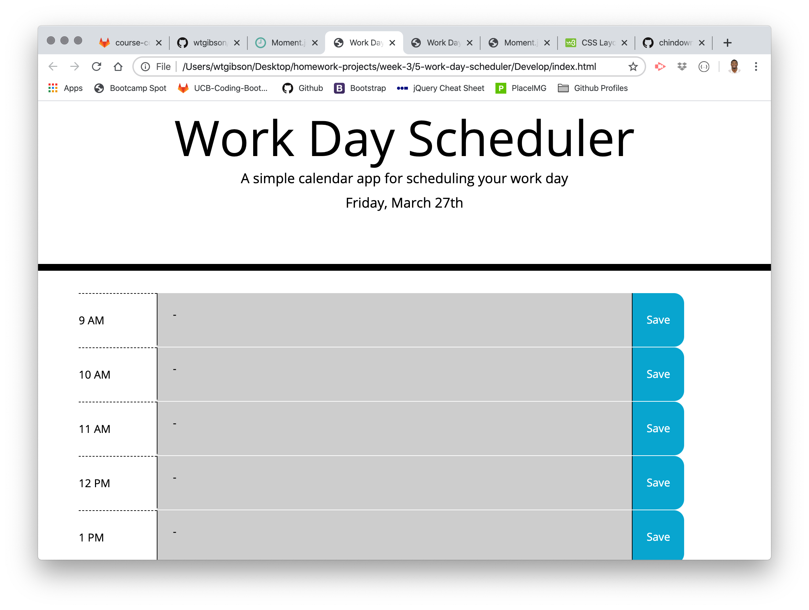

# 05 Third-Party APIs: Work Day Planner

## Summary 

The purpose of the assignment was to create a simple calendar allowing user's to save events for each hour of the work day. The application features dynamically updated HTML and CSS leveraging jQuery.

```
User Story
AS AN employee with a busy schedule
I WANT to add important events to a daily planner
SO THAT I can manage my time effectively

Acceptance Criteria
GIVEN I am using a daily planner to create a schedule
WHEN I open the planner
THEN the current day is displayed at the top of the calendar
WHEN I scroll down
THEN I am presented with timeblocks for standard business hours
WHEN I view the timeblocks for that day
THEN each timeblock is color coded to indicate whether it is in the past, present, or future
WHEN I click into a timeblock
THEN I can enter an event
WHEN I click the save button for that timeblock
THEN the text for that event is saved in local storage
WHEN I refresh the page
THEN the saved events persist
```

## Site Picture


## Technologies Used
- HTML - used to create elements on the DOM
- CSS - styles HTML elements on page
- Bootstrap - CSS framework directed at responsive, mobile first front-end web development
- JavaScript - provides dynamic interactivity on HTML documents
- jQuery - easy to use API library simplifying Javascript actions
- Git - version control system to track changes to source code
- GitHub - hosts repository that can be deployed to GitHub Pages

## Code Snippet

Below is an example of a block of code in the JS file where the business hour elements are being created with classes and attributes as well as a color determination based on whether the hour is in the past, present, of future compared to the time the user logs onto the application. All of which is being done dynamically from the script onto the DOM when the browders renders the page.

JavaScript
```js
for (var i = 0; i < plannerDayHours.length; i++) {
    var newTR = $("<tr>newTR</tr>");
    newTR.addClass("row");
    $(".container").append(newTR);

    var hourDisplay = $("<td>" + plannerDayHours[i].hour + "</td>");
    var eventDisplay = $("<td><textarea>" + plannerDayHours[i].event + "</textarea></td>");
    var saveDisplay = $("<td>Save</td>");

    hourDisplay.addClass("hour");
    eventDisplay.addClass("event");
    saveDisplay.addClass("saveBtn");
    saveDisplay.attr("id", "li" + i);

    if (plannerDayHours[i].number == now) {
        eventDisplay.addClass("present");
    }

    if (plannerDayHours[i].number > now) {
        eventDisplay.addClass("future");
    }

    else if (plannerDayHours[i].number < now) {
        eventDisplay.addClass("past");
    }

    $(newTR).append(hourDisplay, eventDisplay, saveDisplay);

};
```

## Author Links

Will Gibson

[LinkedIn](https://www.linkedin.com/in/wtgibson/)

[GitHub](https://github.com/wtgibson/5-work-day-scheduler)

Special thanks to Mahisha Gunasekaran, Kerwin Hy, and Jeremy Cantwell, and Brad Davis for their input and assistance with the assignment!